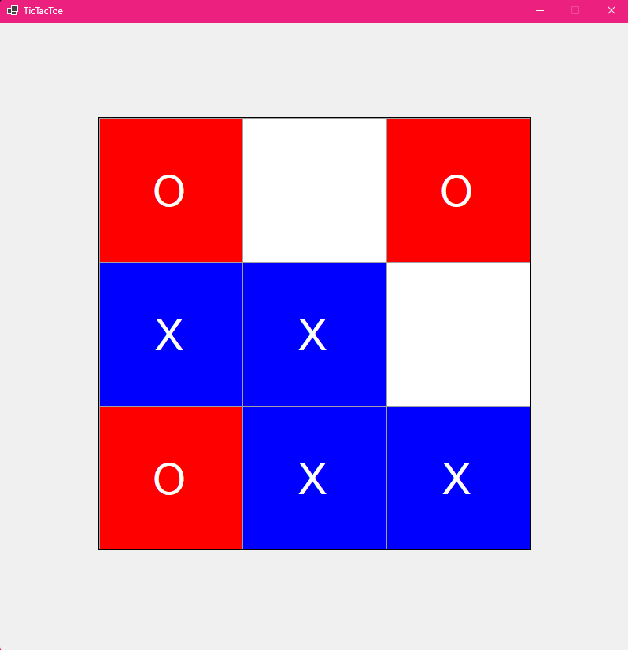

# TicTacToe Bot
> Tugas Makalah IF2211 - Strategi Algoritma

> Live demo [_here_](https://www.youtube.com/watch?v=knup5o6C9_I).

## Table of Contents
* [General Info](#general-information)
* [Technologies Used](#technologies-used)
* [Features](#features)
* [Screenshots](#screenshots)
* [Setup](#setup)
* [Acknowledgements](#acknowledgements)


## General Information
Permainan Tic Tac Toe merupakan sebuah permainan strategi yang melibatkan dua pemain yang cukup sederhana namun tetap menantang. Dalam penelitian ini, penulis akan merepresentasikan pendekatan brute force dan minimax untuk mengembangkan sebuah bot yang dapat bermain secara otomatis melawan pemain manusia. Pendekatan brute force dan minimax melibatkan explorasi semua kemungkinan langkahyang mungkin dalam permainan ini. Bot akan secara sistematis memeriksa setiap langkah yang dapat diambil, mempertimbangkan setiap kemungkinan akibatnya, dan memilih langkah terbaik berdasarkan evaluasi papan permainan saat ini, dan papan permainan saat bot mengambil langkah.

## Technologies Used
- C# Windows Forms Application
- DotNet
- Visual Studio 2022

## Features
Bot Tic Tac Toe yang menggunakan algoritma minimax

## Setup
1. Pastikan anda telah memiliki dotnet framework untuk dapat menjalankan program C#
2. Clone repository program ini pada komputer anda
```
git clone https://github.com/IceTeaXXD/TicTacToe-Bot.git
```

3. Jalankan program menggunakan script berikut pada terminal:
```
./run.bat
```


## Screenshots



## Acknowledgements
- Tuhan Yang Maha Esa
- Dosen Pengampu Mata Kuliah IF2211 Strategi Algoritma
- Asisten Pengampu Mata Kuliah IF2211 Strategi Algoritma
- Our loved ones who support us to finish this project 💖